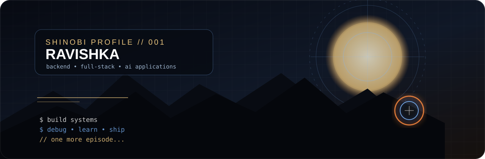

<div align="center">



# Weeb Software Engineer ⚡

### Building systems by day · watching anime by night

[](https://github.com/RavishkaB2003)
[](https://www.linkedin.com/)
[](https://github.com/RavishkaB2003)

</div>

---

## 🌀 Shinobi Profile

> Software Engineering Undergraduate focused on **backend and full-stack development**.

I build web applications and backend systems with a focus on **Java/Spring Boot, React/TypeScript and Node.js**, while exploring AI-integrated applications and modern developer tooling.

```text
CLASS        Backend / Full-Stack Engineer
CORE         Java · Spring Boot · React · TypeScript · Node.js
DATA         MySQL · MongoDB
INTERESTS    System Design · AI Applications · Developer Tools
SIDE QUEST   Anime · UI Design · Building things that look good
```

## ⚔️ Current Arc

| | Mission |
|---|---|
| 🔨 **Building** | Animeta · Spring Boot systems · AI / MCP applications |
| 📚 **Training** | Automated testing · Docker · CI/CD · AWS · System Design |
| 🎯 **Objective** | Become a backend-focused full-stack engineer and build production-quality systems |

## 🏯 Featured Missions

### 🌀 Animeta
**Anime discovery & tracking platform**

`React` `TypeScript` `Tailwind` `AniList GraphQL` `Appwrite`

- External GraphQL API integration
- Debounced search and API-conscious client behavior
- Search/trending analytics persistence
- Responsive cinematic UI and client-side routing

[→ View repository](https://github.com/RavishkaB2003/Animeta)

### ⚔️ Integrated Inventory Management System
**Enterprise-style Spring Boot backend**

`Java` `Spring Boot` `Spring Security` `JPA/Hibernate` `MySQL` `JWT`

- Role-based access control
- Stateless JWT authentication
- DTO-based API design
- Global exception handling and audit-oriented architecture
- Inventory, sales, warehouse and procurement domains

[→ View repository](https://github.com/RavishkaB2003/Java-IMR-SpringBoot)

### ⚡ Kapruka Conversational Gifting Concierge
**AI-powered conversational commerce experience**

`Next.js` `TypeScript` `Gemini` `MCP` `GSAP` `Framer Motion`

- Conversational product discovery
- MCP integration with external commerce capabilities
- Dynamic product and checkout workflows
- Sinhala / Tanglish / English conversational UX

[→ View repository](https://github.com/RavishkaB2003/kapruka-mcp-challenge)

## 🧩 Technique Tree

### 🥷 Core

`Java` `Spring Boot` `React` `TypeScript` `Node.js` `Express.js` `MySQL` `MongoDB`

### ⚙️ Working With

`Next.js` `JavaScript` `Tailwind CSS` `Flutter` `Dart` `Appwrite` `Spring Security` `JPA/Hibernate` `Git` `Postman`

### 🧪 Exploring

`AI / LLM Applications` `MCP` `Docker` `AWS` `Redis` `System Design`

## 📊 Shinobi Analytics

<p align="center">
  
</p>

<p align="center">
  
</p>

<p align="center">
  
</p>

<p align="center">
  
</p>

> **Note:** These cards are generated from GitHub activity. The anime terminology is just the theme — the numbers are real activity, not a measure of engineering skill.

## 🌀 Chakra Flow

<p align="center">
  
</p>

## 🏆 Shinobi Achievements

<p align="center">
  
</p>

## 🍥 Weeb Corner

```text
╭────────────────────────────────────────────────────╮
│                 WEEB PROFILE // 404               │
│                                                    │
│  Favorite Universe   Naruto                       │
│  Shinobi Affiliation Hidden Leaf Village          │
│  Current Status     Training Arc                  │
│                                                    │
│  Productivity loop:                                │
│  Code → Debug → Anime → "one more episode"       │
│  → Realize it's 3 AM → Code again                 │
╰────────────────────────────────────────────────────╯
```

> 🌀 *The goal isn't to know every technology. It's to master the ones that let me build better systems.*

## 📫 Connect

<div align="center">

**Open to software engineering internships, graduate opportunities and interesting projects.**

[GitHub](https://github.com/RavishkaB2003) · [LinkedIn](https://www.linkedin.com/) · [Portfolio](https://github.com/RavishkaB2003)

</div>

---

<sub>Built with Markdown, GitHub Actions, a little chakra, and probably too much anime.</sub>
